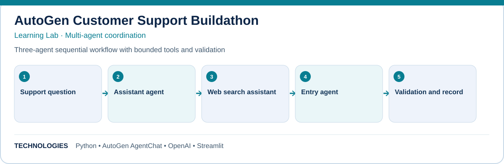

# AutoGen Customer Support Buildathon

**Learning Lab · Multi-agent coordination**

Three-agent sequential workflow with bounded tools and validation.

## What this project explores

- Support question
- Assistant agent
- Web search assistant
- Entry agent
- Validation and record

## Technology

Python · AutoGen AgentChat · OpenAI · Streamlit

## Documentation

- [ARCHITECTURE](docs/ARCHITECTURE.md)
- [GUARDRAILS EVALS](docs/GUARDRAILS-EVALS.md)
- [TESTING](docs/TESTING.md)
- [DOCKER VPS](docs/DOCKER-VPS.md)
- [LEARNINGS](docs/LEARNINGS.md)
- [PROJECT GUIDE](docs/PROJECT-GUIDE.md)

## Scope

This repository documents a hands-on build and its engineering learnings. See the linked project guide for implementation details, setup, testing, and any deployment notes. Features and results should be interpreted within the documented project scope.
