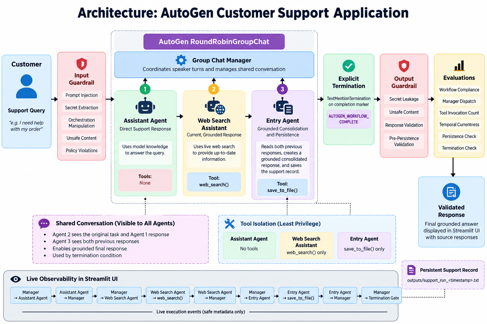

# 🏗️ Architecture & AutoGen Concepts

This project implements a **three-agent customer support workflow using Microsoft AutoGen AgentChat**.

The design focuses on fixed sequential orchestration, shared conversation context, least-privilege tool access, explicit termination, guardrails, evaluations, persistence, and live workflow observability.

---

## Architecture Overview



The architecture diagram shows the complete path from the customer request through security validation, AutoGen orchestration, agent execution, persistence, termination, output validation, and the final Streamlit response.

---

## End-to-End Flow

```text
Customer Query
      ↓
Input Guardrail
      ↓
AutoGen RoundRobinGroupChat
      ↓
Group Chat Manager
      │
      ├──► Assistant Agent
      │        └── Direct model response
      │
      ├──► Web Search Assistant
      │        └── web_search()
      │
      ├──► Entry Agent
      │        ├── Grounded consolidation
      │        └── save_to_file()
      │
      ▼
TextMentionTermination
      ↓
Output Guardrail
      ↓
Evaluations
      ↓
Validated Streamlit Response
```

---

## Three-Agent AutoGen Team

The application uses exactly **three AutoGen `AssistantAgent` instances** inside a `RoundRobinGroupChat`.

| Agent | Responsibility | Tool Access |
|---|---|---|
| **Assistant Agent** | Produces the initial response using model knowledge | None |
| **Web Search Assistant** | Produces a current web-grounded response | `web_search()` |
| **Entry Agent** | Consolidates both responses and persists the support record | `save_to_file()` |

This keeps responsibilities explicit and applies a simple **least-privilege tool model**.

---

## AutoGen Group Chat Manager

The `RoundRobinGroupChat` coordinates the conversation and maintains the required fixed speaker sequence.

```text
Assistant Agent
      ↓
Web Search Assistant
      ↓
Entry Agent
```

The application visualizes this orchestration as:

```text
Group Chat Manager
      │
      ├──► Assistant Agent
      │◄── Response
      │
      ├──► Web Search Assistant
      │       ↔ web_search()
      │◄── Grounded Response
      │
      ├──► Entry Agent
      │       ↔ save_to_file()
      │◄── Consolidated Response
      │
      ▼
Termination Gate
```

This makes the AutoGen conversation-oriented execution model visible while the application is running.

---

## Shared Conversation

The agents operate using the conversation accumulated before their turn.

This allows:

- The **Assistant Agent** to answer the original customer request.
- The **Web Search Assistant** to see the existing conversation and add current web evidence.
- The **Entry Agent** to see both previous responses.
- The Entry Agent to create a **grounded consolidated response**.
- The termination condition to observe the final completion marker.

The shared conversation is therefore the context connecting the three agents.

---

## Tool Isolation

Tools are intentionally restricted to the agent that requires them.

```text
Assistant Agent
└── No tools

Web Search Assistant
└── web_search()

Entry Agent
└── save_to_file()
```

The Assistant Agent cannot search the web or persist records.

The Web Search Assistant cannot write support records.

The Entry Agent cannot perform web searches.

This separation makes tool ownership clear and reduces unnecessary agent capabilities.

---

## Grounded Consolidation

The Entry Agent performs more than persistence.

It receives:

```text
Assistant Agent Response
          +
Web Search Assistant Response
          ↓
Entry Agent
          ↓
Grounded Consolidated Response
```

When current factual information differs between the two earlier responses, the Entry Agent is instructed to prefer the current web-grounded evidence while retaining useful non-conflicting context.

The complete support record is then persisted to a `.txt` file.

---

## Explicit Termination

The workflow does not rely on the group chat stopping implicitly.

The Entry Agent completes the workflow and returns the configured completion marker:

```text
Entry Agent
      ↓
save_to_file()
      ↓
AUTOGEN_WORKFLOW_COMPLETE
      ↓
TextMentionTermination
      ↓
GROUP CHAT STOPPED
```

A message-count limit is also retained as a safety fallback.

Explicit termination prevents the round-robin workflow from continuing into another unnecessary agent turn.

---

## Guardrail Boundaries

Security validation surrounds the agent workflow rather than being treated as an isolated UI feature.

```text
Customer
   ↓
Input Guardrail
   ↓
AutoGen Team
   ↓
Pre-Persistence Validation
   ↓
Persistence
   ↓
Output Guardrail
   ↓
Evaluations
   ↓
Validated Response
```

This protects:

- user input
- orchestration behavior
- agent/tool boundaries
- generated responses
- persisted records
- final displayed output

See [Security Guardrails & Evaluations](GUARDRAILS-EVALS.md) for details.

---

## Live Observability

The Streamlit application exposes safe execution events during processing.

Examples include:

```text
Manager → Assistant Agent
Assistant Agent → Manager

Manager → Web Search Assistant
Web Search Assistant → web_search()
Web Search Assistant → Manager

Manager → Entry Agent
Entry Agent → save_to_file()
Entry Agent → Manager

Manager → Termination Gate
Group Chat → STOP
```

The UI also displays:

- input guardrail status
- active agent
- tool execution
- persistence status
- termination status
- output guardrail status
- deterministic evaluation results

The observability layer displays **workflow events and metadata only**. Private chain-of-thought or hidden model reasoning is not exposed.

---

## Why `RoundRobinGroupChat`?

The Buildathon requires the agents to execute in a fixed sequence.

`RoundRobinGroupChat` fits this requirement because the speaker order is deterministic:

```text
Assistant
   ↓
Web Search
   ↓
Entry
```

A dynamic selector-based team would be useful when the next agent must be chosen according to the task, but that would represent a different orchestration pattern from the required fixed sequential workflow.

---

## Architecture Principles

The implementation follows several practical principles:

**Deterministic orchestration**  
The required agent order is explicit and testable.

**Least privilege**  
Agents receive only the tools required for their role.

**Grounding**  
Current information is retrieved through the dedicated Web Search Assistant.

**Defense in depth**  
Input, orchestration, output, and persistence boundaries are protected.

**Explicit termination**  
The group chat has a visible and testable stopping condition.

**Observability**  
Agent dispatch, tool activity, persistence, termination, guardrails, and evaluations are visible in the UI.

**Single application source**  
The same `app.py` is used locally, in Docker, and during deployment.

---

## Related Documentation

- [← Main README](../README.md)
- [Security Guardrails & Evaluations](GUARDRAILS-EVALS.md)
- [Testing & Validation](TESTING.md)
- [Docker & VPS Deployment](DOCKER-VPS.md)
- [Key Learnings & Engineering Findings](LEARNINGS.md)